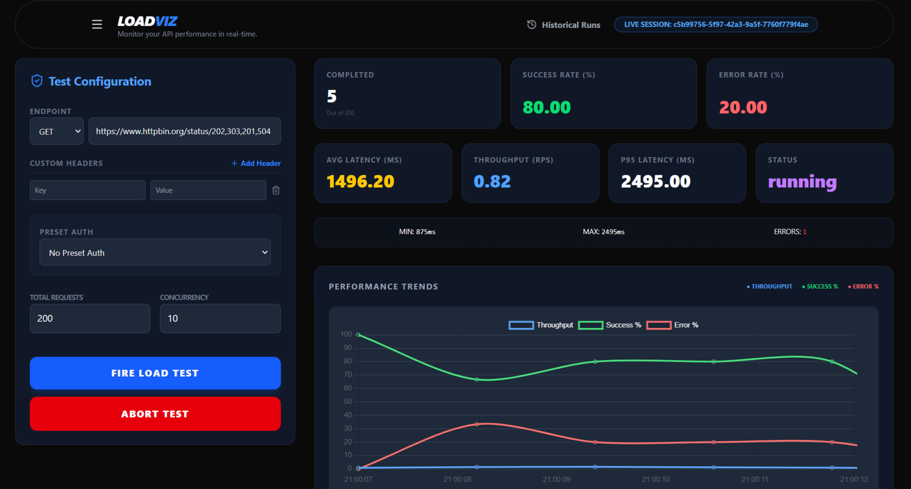
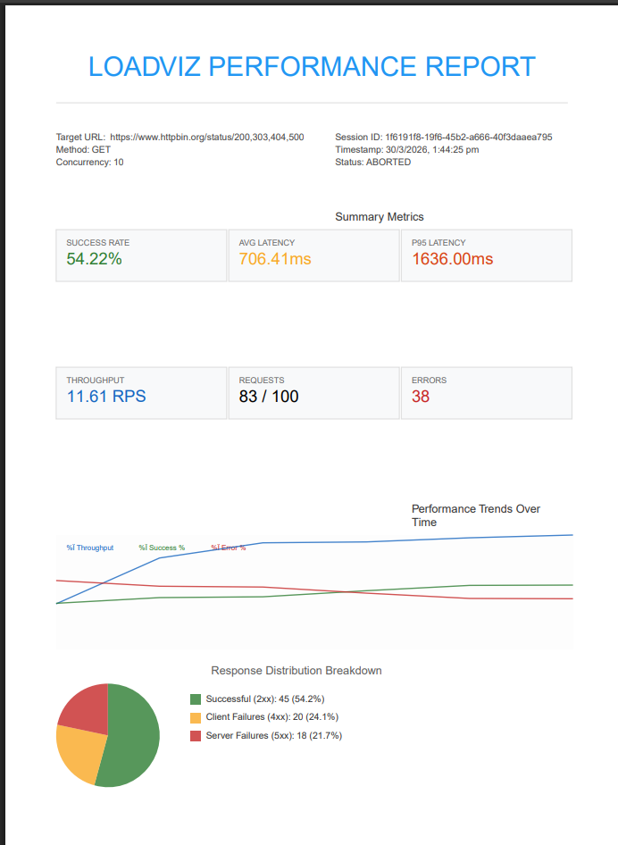

# LOADVIZ

> A high-performance, real-time API load testing and performance visualization engine.

**LoadViz** is a developer tool built to execute high-concurrency API stress tests, track live latency/throughput metrics, and persist run histories for comparative performance regression analysis.

*Note: Since stress testing arbitrary third-party endpoints from a public cloud server can trigger rate limits or security blocks, LoadViz is designed to run locally. This repository contains the complete full-stack implementation, database persistence logic, and system architecture.*

---

# Demo
1.Working Showcased
<video src="assets/working2.mp4" controls width="100%"></video>
2.Features Showcased (Updated)


---

# Running Locally

## 1. Clone the repository

```bash
git clone https://github.com/VanshShrivas/API-Stress-Visualizer
```

---

## 2. Prerequisites & Configuration

Ensure you have **Node.js** (v18+) and **MongoDB** installed and running locally.

Create a `.env` file inside the `Backend` directory:
```env
PORT=3500
MONGODB_URI=mongodb://localhost:27017/loadviz
```

---

## 3. Install dependencies

Backend:

```bash
cd Backend
npm install
```

Frontend:

```bash
cd Frontend/"API STRESS VISUALIZER"
npm install
```

---

## 4. Start backend server

```bash
cd Backend
nodemon index.js
```

---

## 5. Start frontend

```bash
cd Frontend/"API STRESS VISUALIZER"
npm run dev
```

---

## 6. Open the application

```
http://localhost:5173
```

---

# What This Project Demonstrates

This project was built mainly to explore and demonstrate:

- concurrency control
- async request scheduling
- load testing strategies
- metrics aggregation
- real-time visualization
- client-server communication
- performance analysis dashboards

Instead of using tools like **JMeter** or **k6**, the goal was to implement the core ideas **from scratch**.

---

# Architecture Overview

```
Frontend (React + Charts)
        │
        │ HTTP
        ▼
Backend API (Node.js + Express)
        │
        │ Scheduler (Concurrency - Based,  still need to work on Virtual User Model :-))
        ▼
Async Request Workers
        │
        ▼
Metrics Aggregator (Real-time Snapshots)
```

---

# Backend Architecture

The backend is responsible for:

- validating user input
- scheduling concurrent requests
- collecting metrics
- exposing metrics through API endpoints
- generating PDF reports using the metrics
- run comparisons
---

# 1. Input Validation

Before starting a load test, the backend validates:

- target URL
- HTTP method
- headers
- request body
- concurrency level
- total request count

This prevents malformed tests from breaking the scheduler.

Example validation logic:

[View validateEndpoint.js](Backend/utils/validEndpoint.js) and
[View LoadEngine](Backend/services/loadEngine.js)

---

# 2. Load Test Scheduler

The scheduler is the **core component** of the backend.

Its responsibilities:

- respecting the concurrency limit
- sending requests in parallel batches
- scheduling new requests when others finish
- tracking total completed requests

Instead of firing all requests at once, the system behaves like a **controlled worker pool**.

Scheduler example:

[View Scheduler](Backend/utils/scheduler.js)

---

# 3. Request Workers

Each worker performs:

1. send HTTP request
2. measure latency
3. classify response
4. update metrics

# 4. Metrics Aggregation

Metrics are aggregated **in real time during the test**.
-> (currently it is done through **Route Polling**)..

Tracked metrics include:

### Request Metrics

- total requests
- completed requests
- failed requests
- success percentage
- error percentage
- categorized errors count

### Performance Metrics

- average latency
- minimum latency
- maximum latency
- p95 latency

### Throughput

- requests per second

Example aggregation logic:
[View Metrics Aggregation](Backend/utils/metrics.js)

---

# 5. Latency Histogram

Latency buckets help understand **response time distribution**.

Example buckets:

```
0-50 ms
50-100 ms
100-200 ms
200-500 ms
500+ ms
```

Histogram logic:

```js
buckets:[0,100,200,400,800,1000,1500,2000,3000,5000,10000,30000],
counts:[0,0,0,0,0,0,0,0,0,0,0,0],
```

---

# 6. Error Categorization

Errors are categorized into:

| Category | Description |
|--------|--------|
| 2xx | Successful responses |
| 4xx | Client errors |
| 5xx | Server errors |
| Network | Network failures |

This helps identify whether failures are caused by:

- server issues
- client configuration problems
- connectivity errors

Example classification logic:

```js
errorStats: {
            success2xx: 0,
            client4xx: 0,
            server5xx: 0,
            networkErrors: 0
        }
```

---

# 7. PDF Report Generation (NEW)

The backend now supports generating professional, high-fidelity PDF reports.

### Features:
- **Vector-Based Charts**: Unlike screenshots, the PDF uses vector graphics for perfectly crisp charts at any zoom level.
- **Background Recorder**: A "flight recorder" on the backend captures performance snapshots every second during the test.
- **Comprehensive Data**:
  - **Metrics Summary**: Success rate, Average/P95 latency, Throughput.
  - **Performance Trends**: Line charts for Throughput, Error and Success % over time.
  - **Error Distribution**: Pie chart with precise category counts.
  - **Latency Histogram**: Detailed bar chart showing response distribution.

Example Generation Logic:
[View PDF Generator](Backend/utils/pdfGenerator.js)



# 8. Historical Runs & Run Comparison (NEW)

The backend persists completed test runs in MongoDB and provides endpoints to list, query, and compare performance sessions.

### Features:
- **Persistent Storage**: Saves test metrics, configuration settings (URL, method, concurrency, total requests), error statistics, latency histogram distributions, and second-by-second performance history.
- **Side-by-Side Comparison**: Exposes a comparison endpoint that calculates performance deltas (percentage improvements or regressions in latency, throughput, and success rates) between any two historical runs.
- **Sort & Query Features**: Allows querying and sorting historical runs by timestamp, average latency, p95 latency, and throughput.

Example Logic:
- [View Compare Logic](Backend/utils/compareRuns.js)
- [View History Routes](Backend/routes/historyRoutes.js)

---

# API Routes

---

## Start Load Test

```
POST /api/start-load-test
```

Starts a new load test.

Payload:

```json
{
  "url": "...",
  "method": "...",
  "headers": {},
  "body": {},
  "totalRequests": 100,
  "concurrency": 10
}
```

---

## Get Test Metrics

```
GET /api/send-test-info/:id
```

Returns metrics for the running or completed test.

Example route:

```js
GET /api/send-test-info/07a0c5e3-3824-441a-997d-771966563377
```

---

## Abort Test

```
GET /api/abort-test/:id
```

Stops an ongoing test.

---

## Get Historical Runs

```
GET /api/history?sortBy=timestamp&order=desc
```

Retrieves a list of all historical runs. Supports query parameters `sortBy` (`timestamp`, `metrics.avgLatency`, `metrics.p95Latency`, `metrics.throughput`) and `order` (`asc`, `desc`).

---

## Get Historical Run Details

```
GET /api/history/:testId
```

Retrieves the full metrics breakdown, response distribution, second-by-second performance history, and configurations of a specific completed run.

---

## Compare Runs

```
GET /api/compare?runA=:idA&runB=:idB
```

Compares two historical runs side-by-side. Returns the complete data for both runs along with computed performance deltas (percentage differences in throughput, average latency, and success rate).

---

## Download PDF Report

```
GET /api/download-report/:id
```

Generates and downloads a high-fidelity PDF report of the specified test run session (supports both active cached runs and database-persisted historical runs).

---

# Frontend Architecture

The frontend is built with:

- React
- Chart.js
- TailwindCSS

The frontend performs three major tasks:

1. configure load tests
2. fetch live metrics
3. visualize performance data

---

# Config Form

Users configure:

- request URL
- HTTP method
- headers
- request body
- concurrency
- total requests
- authentication
---

# Starting a Test

The frontend sends a request:

```
POST /api/start-load-test
```

---

# Real-Time Metrics Polling

After a test starts, the frontend continuously fetches (Polling) metrics using:

```
GET /api/send-test-info/:testId
```

This allows the dashboard to update **in real time**.

Example polling logic:
```
cd Frontend/"API STRESS VISUALIZER/src/components/useLoadTest.js
```

---

# Data Visualizations

The dashboard includes several visualizations.

### Metrics Grid

Displays:

- total requests
- success rate
- error rate
- average latency
- p95 latency
- status (of the concerned testState: running/aborted/completed)

---

### Performance Trends

A live chart showing:

- throughput
- success %
- error %

---

### Latency Histogram

Displays response time distribution.

---

### Error Categorization

Pie / Bar chart showing response breakdown.

---

# Current Limitations / Future Improvements

### a. Error Categorization (Fully Implemented)

Error categorization has now been implemented to identify specific response types.

---

### b. Session Persistence (Fully Implemented)

Historical test runs are now persisted using MongoDB. If the backend server restarts, all past session metrics, trends, and reports can still be retrieved, compared, or downloaded as PDFs.


---

### c. Per-Interval Health Metrics

Another planned improvement is **time-window metrics**.

Instead of only cumulative metrics, the system should show:

```
metrics per 10 seconds
```

This helps detect patterns such as:

- endpoint slowing down over time
- early failures
- late-stage degradation

---
