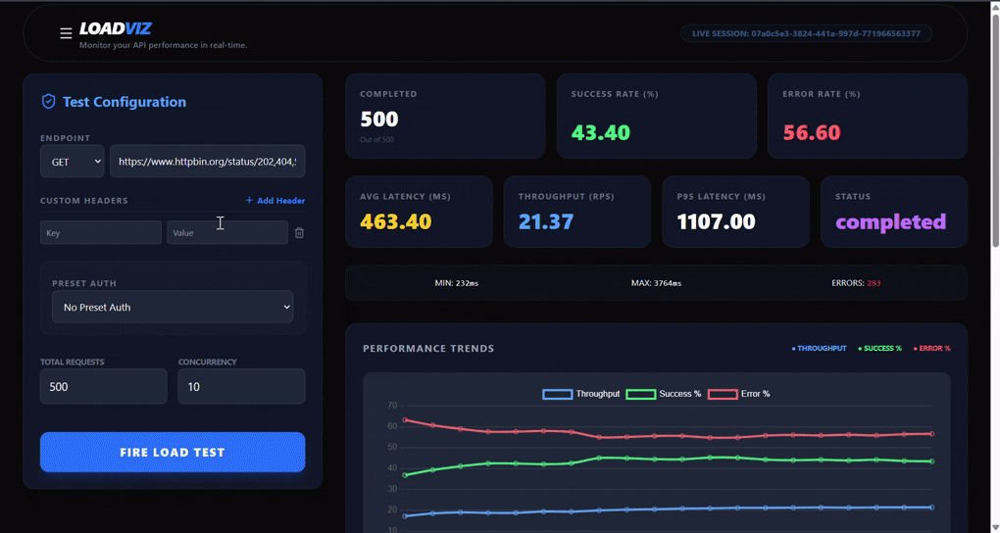
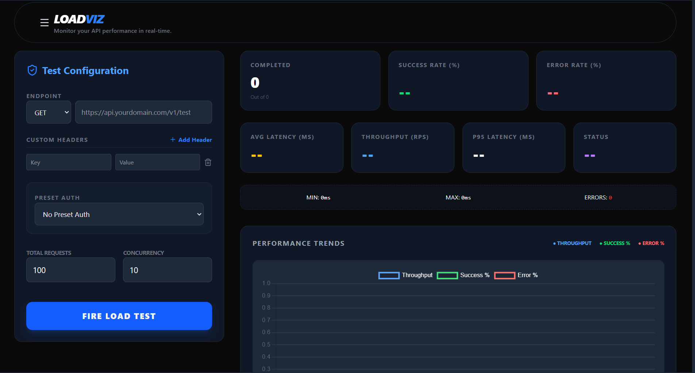

# LOADVIZ

> Real-time API Load Testing & Performance Visualization Tool

“I built this tool mainly as a learning project. It demonstrates concurrency handling, async scheduling, metrics aggregation, and API testing concepts. I chose not to deploy it publicly because stress testing arbitrary APIs from a server could cause legal or technical issues. The repo shows the full implementation and design.”

---

# Demo
1.Working Showcased

2.Features Showcased


---

# Running Locally

## 1. Clone the repository

```bash
git clone https://github.com/VanshShrivas/API-Stress-Visualizer
```

---

## 2. Install dependencies

Backend:

```bash
cd Backend
npm install
```

Frontend:

```bash
cd Frontend/"API STRESS VISUALIZER"
npm install
```

---

## 3. Start backend server

```bash
cd Backend
nodemon index.js
```

---

## 4. Start frontend

```bash
cd Frontend/"API STRESS VISUALIZER"
npm run dev
```

---

## 5. Open the application

```
http://localhost:5173
```

---

# What This Project Demonstrates

This project was built mainly to explore and demonstrate:

- concurrency control
- async request scheduling
- load testing strategies
- metrics aggregation
- real-time visualization
- client-server communication
- performance analysis dashboards

Instead of using tools like **JMeter** or **k6**, the goal was to implement the core ideas **from scratch**.

---

# Architecture Overview

```
Frontend (React + Charts)
        │
        │ HTTP
        ▼
Backend API (Node.js + Express)
        │
        │ Scheduler (Concurrency - Based,  still need to work on Virtual User Model :-))
        ▼
Async Request Workers
        │
        ▼
Metrics Aggregator (Real-time Snapshots)
```

---

# Backend Architecture

The backend is responsible for:

- validating user input
- scheduling concurrent requests
- collecting metrics
- exposing metrics through API endpoints

---

# 1. Input Validation

Before starting a load test, the backend validates:

- target URL
- HTTP method
- headers
- request body
- concurrency level
- total request count

This prevents malformed tests from breaking the scheduler.

Example validation logic:

[View validateEndpoint.js](Backend/utils/validEndpoint.js) and
[View LoadEngine](Backend/services/loadEngine.js)

---

# 2. Load Test Scheduler

The scheduler is the **core component** of the backend.

Its responsibilities:

- respecting the concurrency limit
- sending requests in parallel batches
- scheduling new requests when others finish
- tracking total completed requests

Instead of firing all requests at once, the system behaves like a **controlled worker pool**.

Scheduler example:

[View Scheduler](Backend/utils/scheduler.js)

---

# 3. Request Workers

Each worker performs:

1. send HTTP request
2. measure latency
3. classify response
4. update metrics

# 4. Metrics Aggregation

Metrics are aggregated **in real time during the test**.
-> (currently it is done through **Route Polling**)..

Tracked metrics include:

### Request Metrics

- total requests
- completed requests
- failed requests
- success percentage
- error percentage
- categorized errors count

### Performance Metrics

- average latency
- minimum latency
- maximum latency
- p95 latency

### Throughput

- requests per second

Example aggregation logic:
[View Metrics Aggregation](Backend/utils/metrics.js)

---

# 5. Latency Histogram

Latency buckets help understand **response time distribution**.

Example buckets:

```
0-50 ms
50-100 ms
100-200 ms
200-500 ms
500+ ms
```

Histogram logic:

```js
buckets:[0,100,200,400,800,1000,1500,2000,3000,5000,10000,30000],
counts:[0,0,0,0,0,0,0,0,0,0,0,0],
```

---

# 6. Error Categorization

Errors are categorized into:

| Category | Description |
|--------|--------|
| 2xx | Successful responses |
| 4xx | Client errors |
| 5xx | Server errors |
| Network | Network failures |

This helps identify whether failures are caused by:

- server issues
- client configuration problems
- connectivity errors

Example classification logic:

```js
errorStats: {
            success2xx: 0,
            client4xx: 0,
            server5xx: 0,
            networkErrors: 0
        }
```

---

# 7. PDF Report Generation (NEW)

The backend now supports generating professional, high-fidelity PDF reports.

### Features:
- **Vector-Based Charts**: Unlike screenshots, the PDF uses vector graphics for perfectly crisp charts at any zoom level.
- **Background Recorder**: A "flight recorder" on the backend captures performance snapshots every second during the test.
- **Comprehensive Data**:
  - **Metrics Summary**: Success rate, Average/P95 latency, Throughput.
  - **Performance Trends**: Line charts for Throughput, Error and Success % over time.
  - **Error Distribution**: Pie chart with precise category counts.
  - **Latency Histogram**: Detailed bar chart showing response distribution.

Example Generation Logic:
[View PDF Generator](Backend/utils/pdfGenerator.js)


---

# API Routes

---

## Start Load Test

```
POST /api/start-load-test
```

Starts a new load test.

Payload:

```json
{
  "url": "...",
  "method": "...",
  "headers": {},
  "body": {},
  "totalRequests": 100,
  "concurrency": 10
}
```

---

## Get Test Metrics

```
GET /api/send-test-info/:id
```

Returns metrics for the running or completed test.

Example route:

```js
GET /api/send-test-info/07a0c5e3-3824-441a-997d-771966563377
```

---

## Abort Test

```
GET /api/abort-test/:id
```

Stops an ongoing test.

---

# Frontend Architecture

The frontend is built with:

- React
- Chart.js
- TailwindCSS

The frontend performs three major tasks:

1. configure load tests
2. fetch live metrics
3. visualize performance data

---

# Config Form

Users configure:

- request URL
- HTTP method
- headers
- request body
- concurrency
- total requests
- authentication
---

# Starting a Test

The frontend sends a request:

```
POST /api/start-load-test
```

---

# Real-Time Metrics Polling

After a test starts, the frontend continuously fetches (Polling) metrics using:

```
GET /api/send-test-info/:testId
```

This allows the dashboard to update **in real time**.

Example polling logic:
```
cd Frontend/"API STRESS VISUALIZER/src/components/useLoadTest.js
```

---

# Data Visualizations

The dashboard includes several visualizations.

### Metrics Grid

Displays:

- total requests
- success rate
- error rate
- average latency
- p95 latency
- status (of the concerned testState: running/aborted/completed)

---

### Performance Trends

A live chart showing:

- throughput
- success %
- error %

---

### Latency Histogram

Displays response time distribution.

---

### Error Categorization

Pie / Bar chart showing response breakdown.

---

# Current Limitations / Future Improvements

### a. ~~Error Categorization~~

Error categorization has been implemented to identify specific response types.

---

### b. Session Persistence Issue

Currently metrics are stored **only in server memory**.
"That's why I have currrently implemented automatica deletion of testStates which are older than 15minutes and this process happens every 30 minutes."

If the server restarts:

- previous session metrics are lost
- recent sessions cannot be restored

Possible improvements:

- store metrics in **localStorage**
- store metrics in a **database**

---

### c. Per-Interval Health Metrics

Another planned improvement is **time-window metrics**.

Instead of only cumulative metrics, the system should show:

```
metrics per 10 seconds
```

This helps detect patterns such as:

- endpoint slowing down over time
- early failures
- late-stage degradation

---
